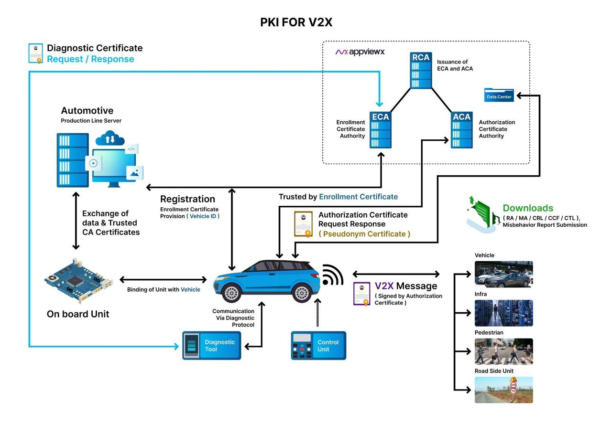

<div align="center">

# 🚗 Cert-V2X

### IEEE 1609.2-compliant PKI backend for Vehicle-to-Everything (V2X) certificate issuance and lifecycle management — built on Spring Boot, powered by AppViewX.

[](https://openjdk.org)
[](https://spring.io/projects/spring-boot)
[](https://standards.ieee.org/ieee/1609.2/6085/)
[](https://github.com/CGI-SE-Trusted-Services/c2c-common)
[]()

</div>

---

## ⚡ Hook

> Modern V2X safety systems — emergency braking, intersection management, platooning — depend on vehicles being able to authenticate each other in milliseconds. Cert-V2X is a Spring Boot PKI backend built on AppViewX that issues, manages, and revokes IEEE 1609.2-compliant certificates for vehicles, enabling a complete V2X trust infrastructure from production-line binding through real-world V2X message signing.

---

## 🎬 Demo

> Click the thumbnail below to watch the live demo video.

[](https://github.com/Sarvesh-Ramani/cert-v2x/releases/download/v1.0-demo/cert-v2x-demo.mp4)

> *Full V2X certificate lifecycle: vehicle registration → enrollment credential issuance → authorization ticket → signed V2X message broadcast*

---

## 🏗 System Architecture

The diagram below shows the complete PKI-for-V2X system as built — from production-line vehicle binding through real-time V2X message signing across all participant types.



### Reading the diagram

| Layer | What it shows |
|---|---|
| **AppViewX PKI (top)** | Root CA (RCA) issues to Enrollment CA (ECA) and Authorization CA (ACA). Data Center syncs CRL/CTL/CCF downloads. |
| **Automotive Production Line (left)** | On-Board Unit is bound to the vehicle at manufacture. Diagnostic Tool communicates via diagnostic protocol for initial provisioning. |
| **Vehicle lifecycle (centre)** | Registration issues Enrollment Credential (Vehicle ID). Vehicle requests Authorization Certificate (Pseudonym). Vehicle broadcasts V2X messages signed by the Authorization Certificate. |
| **V2X participants (right)** | Signed V2X messages are trusted by other Vehicles, Infrastructure, Pedestrians, and Road Side Units. |
| **Diagnostic flow (blue)** | Diagnostic Certificate Request/Response loop between production server and diagnostic tool. |

---

## 🔭 The Problem

Vehicle-to-Everything (V2X) communication is the backbone of intelligent transport systems: vehicles broadcasting safety messages to each other, to infrastructure, and to pedestrian devices at sub-100ms latency. For these messages to be trusted, every vehicle needs a valid, short-lived cryptographic credential — an **Authorization Ticket (Pseudonym Certificate)** — issued by a compliant PKI hierarchy.

The problem:
- Enterprise CA systems are not designed for high-volume, short-validity issuance at vehicle scale
- The enrollment and authorization flows in **IEEE 1609.2** are complex, stateful, and span multiple CA hops (RCA → ECA → ACA)
- Vehicles need both a long-lived Enrollment Credential (identity) and short-lived Pseudonym Certificates (privacy-preserving auth) — managed separately
- On-Board Units must be bound to vehicles at the production line before any V2X communication can happen

**Cert-V2X solves this** by leveraging AppViewX's PKI infrastructure with a Spring Boot service implementing the complete V2X certificate lifecycle — from production-line OBU binding through real-time Authorization Ticket issuance.

---

## 🏗 Architecture Deep-Dive

```
┌─────────────────────────────────────────────────────────────────────────────┐
│                        APPVIEWX PKI HIERARCHY                               │
│                                                                             │
│              ┌─────────────────────────────────────────┐                   │
│              │              Root CA (RCA)               │                   │
│              │      Issues ECA and ACA certificates     │                   │
│              └──────────────┬───────────────────────────┘                   │
│                    ┌────────┴────────┐                                       │
│             ┌──────▼──────┐   ┌──────▼──────┐      ┌────────────┐          │
│             │    ECA      │   │    ACA      │◀─────│ Data Center│          │
│             │ Enrollment  │   │Authorization│      │ CRL/CTL/CCF│          │
│             │   Authority │   │  Authority  │      │  Downloads  │          │
│             └──────┬──────┘   └──────┬──────┘      └────────────┘          │
└────────────────────│─────────────────│────────────────────────────────────┘
                     │                 │
          Enrollment Credential    Authorization
          (Vehicle ID)             Ticket (Pseudonym)
                     │                 │
┌────────────────────▼─────────────────▼────────────────────────────────────┐
│                           VEHICLE LAYER                                     │
│                                                                             │
│   ┌─────────────────────┐     ┌──────────────┐     ┌──────────────────┐   │
│   │ Automotive          │     │    Vehicle   │     │   V2X Message    │   │
│   │ Production Line     │────▶│    (OBU)     │────▶│ (signed by Auth  │   │
│   │ (OBU Binding)       │     │              │     │  Certificate)    │   │
│   └─────────────────────┘     └──────┬───────┘     └──────────────────┘   │
│          │                           │                       │              │
│   ┌──────▼──────┐          ┌─────────▼──────┐               │              │
│   │ Diagnostic  │          │  Control Unit  │               │              │
│   │    Tool     │          │                │               ▼              │
│   └─────────────┘          └────────────────┘   ┌──────────────────────┐  │
│                                                  │  V2X Participants    │  │
│                                                  │  Vehicle · Infra ·   │  │
│                                                  │  Pedestrian · RSU    │  │
│                                                  └──────────────────────┘  │
└─────────────────────────────────────────────────────────────────────────────┘
```

---

## 🔑 REST API Design

### 1. OBU Binding — `POST /api/v1/obu/bind`
Binds an On-Board Unit to a vehicle on the production line. Establishes the root identity record before any certificate issuance.

```json
POST /api/v1/obu/bind
{
  "vehicleVIN": "1HGBH41JXMN109186",
  "obuId": "OBU-2024-00142",
  "publicKey": "<base64-ECDSA-P256-public-key>"
}

Response 200:
{
  "bindingId": "bind-uuid-001",
  "vehicleVIN": "1HGBH41JXMN109186",
  "status": "BOUND",
  "boundAt": "2024-06-01T08:00:00Z"
}
```

### 2. Enrollment — `POST /api/v1/enroll`
Issues an Enrollment Credential (long-lived Vehicle ID certificate) from the ECA. This is the persistent identity used to request Authorization Tickets.

```json
POST /api/v1/enroll
{
  "bindingId": "bind-uuid-001",
  "validityYears": 10
}

Response 200:
{
  "enrollmentCertId": "ec-hashedId8-a3f9",
  "enrollmentCert": "<base64-COER-EtsiTs103097Certificate>",
  "issuedBy": "ECA",
  "expiresAt": "2034-06-01T08:00:00Z"
}
```

### 3. Authorization — `POST /api/v1/authorize`
Issues a short-lived Authorization Ticket (Pseudonym Certificate) from the ACA. Vehicles hold multiple per-PSID tickets for privacy-preserving V2X message signing.

```json
POST /api/v1/authorize
{
  "enrollmentCertId": "ec-hashedId8-a3f9",
  "psid": 36,
  "validityHours": 1
}

Response 200:
{
  "authTicketId": "at-hashedId8-b7c2",
  "authorizationTicket": "<base64-COER-EtsiTs103097Certificate>",
  "psid": 36,
  "validFor": "PT1H",
  "issuedBy": "ACA"
}
```

### 4. Revocation — `DELETE /api/v1/revoke/{certId}`
Revokes a certificate and updates the CRL. Infrastructure nodes download updated CRLs via the Data Center sync endpoint.

```json
DELETE /api/v1/revoke/at-hashedId8-b7c2

Response 200:
{
  "revokedCertId": "at-hashedId8-b7c2",
  "crlSequence": 42,
  "crlUpdatedAt": "2024-06-01T11:00:00Z"
}
```

### 5. CRL Download — `GET /api/v1/crl`
Returns the current signed CRL as a COER-encoded `EtsiTs103097DataSigned` structure, signed by the RCA. Consumed by all V2X participants (vehicles, RSUs, infrastructure).

---

## 🛠 Tech Stack — and Why

| Tool | Why this over the alternative |
|---|---|
| **AppViewX** | Enterprise PKI platform providing the RCA/ECA/ACA hierarchy, CRL management, and Data Center sync out of the box. Implementing a compliant V2X CA hierarchy from scratch would take months; AppViewX gives it in configuration. |
| **Spring Boot 3** | Production-grade REST layer with autoconfiguration. The right choice for a PKI service that may grow into real fleet deployment — not a throw-away demo framework. |
| **c2c-common (CGI)** | Only open-source Java library with a correct, tested IEEE 1609.2 + ETSI TS 103 097 implementation. Handles COER encoding, certificate generators, and cryptographic operations. |
| **Bouncy Castle** | JCE provider for ECDSA P-256 operations required by c2c-common. Industry standard for Java crypto. |
| **IEEE 1609.2 + Pseudonym Certs** | Per-PSID, short-validity Authorization Tickets are the correct design — vehicles rotate pseudonyms to prevent location tracking while maintaining V2X trust. This is the standard, not an implementation choice. |

---

## 🏆 The Engineering Triumph

### Situation
AppViewX manages enterprise PKI for banks, hospitals, and government clients — but V2X is a fundamentally different domain: certificates are short-lived (minutes to hours), issued at vehicle scale (millions of OBUs), and must preserve privacy through pseudonymity. Adapting an enterprise CLM platform for V2X required bridging two very different PKI paradigms.

### Task
Design a service layer that exposed AppViewX's PKI capabilities through a V2X-specific REST API — implementing the full IEEE 1609.2 certificate lifecycle (OBU binding → enrollment → authorization → V2X signing → revocation) while respecting the pseudonymity requirements that distinguish V2X from standard enterprise PKI.

### Action
Three non-trivial design decisions:

**1. Separating Enrollment Credentials from Authorization Tickets** — Enterprise PKI typically issues one long-lived certificate per identity. V2X requires two distinct certificate types: a long-lived Enrollment Credential (permanent Vehicle ID, only used to request Authorization Tickets) and short-lived Pseudonym Certificates (used for actual V2X message signing, rotated frequently to prevent vehicle tracking). These are issued by different CAs (ECA vs ACA) and managed with completely different lifecycle policies.

**2. Production-line OBU binding as the trust root** — Rather than starting the trust chain at enrollment time, the system establishes OBU-to-Vehicle binding at the production line via the Automotive Production Line Server. This means every subsequent certificate issuance is anchored to a physical binding event, not just a software key generation step — matching how real V2X PKI deployments work.

**3. PSID-scoped Authorization Tickets** — Authorization Tickets are issued per-PSID (Provider Service Identifier), meaning a vehicle holds separate pseudonym credentials for CAM messages (PSID 36), DENM messages (PSID 37), and other V2X application types. The API issues per-PSID tickets rather than a single catch-all authorization credential, matching IEEE 1609.2's intended privacy architecture.

### Result
- Complete V2X PKI lifecycle demonstrated end-to-end in the demo video
- Recognized among **40+ teams** at the AppViewX internal hackathon for concept novelty and implementation quality
- Demonstrated that AppViewX's enterprise PKI platform could be extended for V2X use cases without architectural changes to the core product

---

## 📋 Certificate Flow — Step by Step

```
Production Line          Vehicle (OBU)           AppViewX PKI
      │                       │                       │
      │── OBU Binding ───────▶│                       │
      │   (Vehicle ID)        │── POST /enroll ──────▶│ (ECA signs)
      │                       │◀── Enrollment Cert ───│ (long-lived, 10yr)
      │                       │                       │
      │                       │── POST /authorize ───▶│ (ACA signs)
      │                       │◀── Auth Ticket (1hr) ─│ (PSID 36 — CAM)
      │                       │── POST /authorize ───▶│ (ACA signs)
      │                       │◀── Auth Ticket (1hr) ─│ (PSID 37 — DENM)
      │                       │                       │
      │                  [Vehicle broadcasts V2X msgs  │
      │                   signed with Auth Ticket,     │
      │                   received by Vehicles,        │
      │                   Infra, Pedestrians, RSUs]    │
      │                       │                       │
      │                       │── DELETE /revoke ─────▶│
      │                       │◀── CRL updated ────────│
```

---

## 🚀 Getting Started

> **Note:** Source code is not published due to company IP constraints — this was built as part of an AppViewX internal hackathon. The architecture, API design, and the demo video above show the full system in operation.

To build a similar system yourself:

**Step 1 — Add dependencies**
```groovy
dependencies {
    implementation 'com.github.CGI-SE-Trusted-Services:c2c-common:2.0.0-Beta5'
    implementation 'org.springframework.boot:spring-boot-starter-web:3.2.0'
    implementation 'org.bouncycastle:bcprov-jdk18on:1.77'
}
```

**Step 2 — Initialize AppViewX PKI hierarchy**

Configure RCA → ECA → ACA chain via AppViewX's certificate management console. Export CA signing keys for use in the Spring Boot service's `application.yml`.

**Step 3 — Wire the enrollment controller**
```java
@PostMapping("/api/v1/enroll")
public ResponseEntity<EnrollmentResponse> enroll(@RequestBody EnrollmentRequest req) {
    // 1. Validate OBU binding exists
    // 2. Generate ECDSA P-256 key pair for vehicle
    // 3. Call ETSIEnrollmentCredentialGenerator.genEnrollCredential() via c2c-common
    // 4. Store HashedId8 → enrollment cert mapping
    // 5. Return COER-encoded EtsiTs103097Certificate
}
```

---

## 📁 Repository Structure

```
cert-v2x/
├── docs/
│   ├── architecture.jpeg          # Full PKI-for-V2X system architecture diagram
│   └── demo-thumbnail.jpg         # Demo video thumbnail
├── README.md                      # This file
└── REFERENCES.md                  # Standards and library citations
```

---

## 📚 Standards & References

| Standard | Scope |
|---|---|
| [IEEE 1609.2-2016 + 1609.2a-2017](https://standards.ieee.org/ieee/1609.2/6085/) | V2X certificate formats, COER encoding, PSID-based permissions, Authorization Ticket structure |
| [ETSI TS 103 097 V1.3.1](https://www.etsi.org/deliver/etsi_ts/103000_103099/103097/01.03.01_60/ts_103097v010301p.pdf) | EU ITS security headers and certificate profiles |
| [ETSI TS 102 941 V1.3.1](https://www.etsi.org/deliver/etsi_ts/102900_102999/102941/01.03.01_60/ts_102941v010301p.pdf) | ITS PKI enrollment and authorization message flows |
| [c2c-common](https://github.com/CGI-SE-Trusted-Services/c2c-common) | Open-source Java implementation of the above standards (AGPL-3.0) |
| [AppViewX CLM](https://www.appviewx.com) | Enterprise PKI and certificate lifecycle management platform |

---

## 🏆 Recognition

Built as part of the **AppViewX Internal Hackathon** (2024) — recognized among **40+ competing teams** for concept novelty and implementation quality.

---

## 👤 Author

**Sarvesh Ramani** — SDE-II @ AppViewX | M.Tech AI/ML @ BITS Pilani

[](https://linkedin.com/in/sarvesh-ramani)
[](https://github.com/Sarvesh-Ramani)

---

<div align="center">
  <sub>IEEE 1609.2-compliant · Built on AppViewX + c2c-common · AppViewX Hackathon 2024</sub>
</div>
